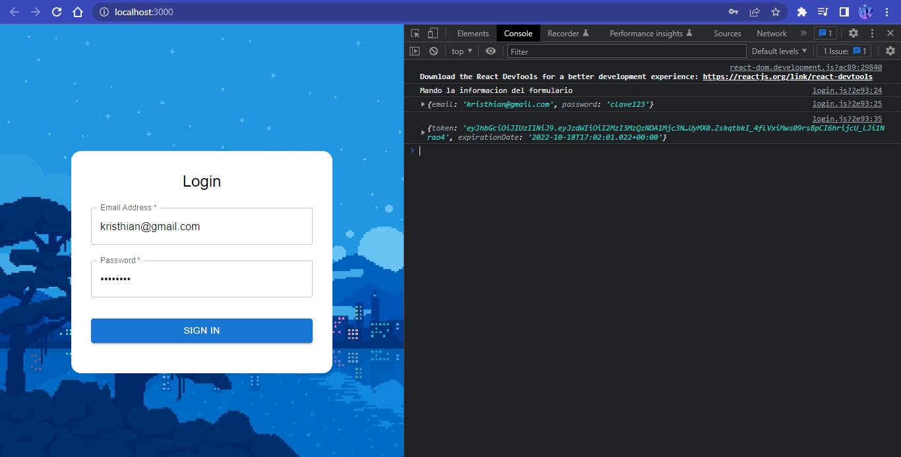

## Getting Started

First, install the packages and then run the development server:

```bash
npm install
npm run dev
```

Open [http://localhost:3000](http://localhost:3000) with your browser to see the result.

## Login page

This login component send a POST request to the /auth/v1 endpoint of the user service


That POST request gets as response a JSON object that contains the access token and his expiration date



## Home page

This page makes a GET request to the task service and then display the received data


## Learn More

To learn more, take a look at the following resources:

- [Next.js Documentation](https://nextjs.org/docs) - Learn about Next.js features and API.

- [Next.js Routing Documentation](https://nextjs.org/docs/routing/introduction) - Learn about Next.js routing

- [CORS Policy configuration](https://spring.io/guides/gs/rest-service-cors/) - Learn about the configuration of CORS Policy in spring boot MVC

## Author

- Kirsthian David Segura